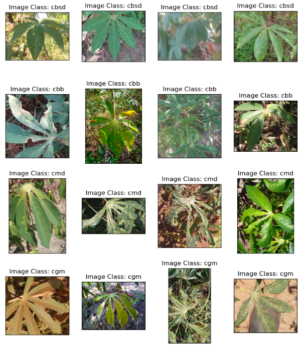

# Computer-Vision-for-Cassava-Disease-Detection
Agriculture is the backbone of many economies, and ensuring its efficiency is critical.

## Project Overview
Agriculture is a crucial economic activity, and investments in this sector can be undermined by factors such as crop diseases. This project leverages machine learning to predict and detect diseases in cassava crops, enhancing agricultural profitability by enabling real-time monitoring and quick intervention.

## Methodology
This project follows the CRISP-DM (Cross Industry Standard Process for Data Mining) methodology, which consists of six phases:

- Business Understanding: Identifying the problem and defining the project goals.
- Data Understanding: Exploring and understanding the data, particularly images in this case.
- Data Preparation: Preprocessing images, including resizing and balancing the dataset.
- Data Modeling: Building and training models using pretrained neural networks.
- Model Evaluation: Assessing model performance and making improvements.
- Model Deployment: Deploying the model for real-world use.

## Tech Stack
- PIL: For image loading and manipulation.
- Matplotlib: For data and image visualization.
- PyTorch & Torchvision: For deep learning, specifically in computer vision.
- Project Implementation via CRISP-DM

01. Business Understanding
Novel Farms, a leading agricultural company, faces challenges in monitoring their large cassava plantation for diseases. Traditional methods are costly and time-consuming. This project aims to develop a machine learning model that can detect diseases in cassava crops, reducing costs and improving efficiency.

02. Data Understanding
The dataset consists of images categorized into five classes:

- Cassava Bacterial Blight (CBB)
- Cassava Brown Steak Disease (CBSD)
- Cassava Green Mite (CGM)
- Cassava Mosaic Disease (CMD)
- Healthy
- 

#### Key observations:

The images are large and vary in size.
The classes are imbalanced.

03. Data Preparation

#### Steps taken:

- Image Resizing: Standardized size to handle the large and varying dimensions.
- Label Balancing: Addressed imbalance through specialized metrics and pre-trained models.

04. Data Modeling
Utilized pre-trained models like Resnet-18 and VGG-13 for feature extraction and fine-tuning. Key observations include:

- No significant difference in performance when using Resnet-18 as a feature extractor or finetuned model.
- VGG-13 performed well but was prone to overfitting.
- Smaller image sizes improved model speed and performance.

05. Model Evaluation
- Training Time: Additional epochs could enhance performance.
- Pretrained Models: Exploring other models could yield better results.
- Data Augmentation: Implementing more augmentations might improve accuracy.
- Hyperparameter Tuning: Experimenting with different values could optimize results.
- Initialization Schemes: Testing various weight initialization methods could improve model stability.

